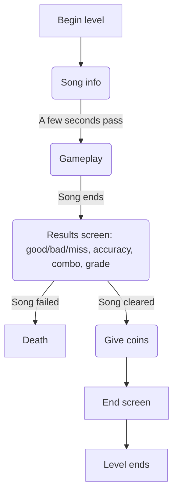

# level flow
The section details are explained in the other files in this folder.

Everything has a black border around the screen in some ratio to combat widescreen issues :/
Although that _does_ make fitting UI to the screen easier yippee
