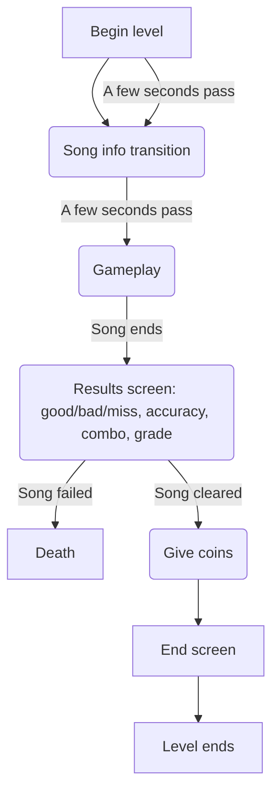

# level flow
The section details are explained in the other files in this folder.

```mermaid
flowchart TD
    0[Begin level] -->SI
    0 -->|A few seconds pass| SI(Song info transition)
    SI -->|A few seconds pass| GP(Gameplay)
    GP -->|Song ends| RS(Results screen: good/bad/miss, accuracy, combo, grade)
    RS -->|Song failed| GP0[Death]
    RS -->|Song cleared| GP1(Give coins)
    GP1 --> 9998[End screen] --> 9999[Level ends]
```

Everything has a black border around the screen in a 16:9 ratio to combat widescreen issues :/
