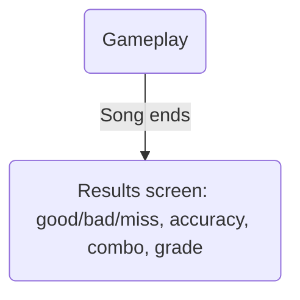

# Gameplay

## Overall UI
The gameplay UI looks like a genuine Taiko gameplay UI, although stripped down due to engine limitations,
and contains the following elements:
+ Gameplay line: playfield, drum icon, combo counter
+ Song title
+ Score/clear bar
+ Background

## Gameplay line
+ playfield: big gray rectangle + yellow rectangle on left edge
+ drum icon and receptor icon
+ combo counter (counter object)

# Score/clear bar
+ horizontally moving bar with collision block at the end to detect if song is cleared
+ collision block in the "clear" section
