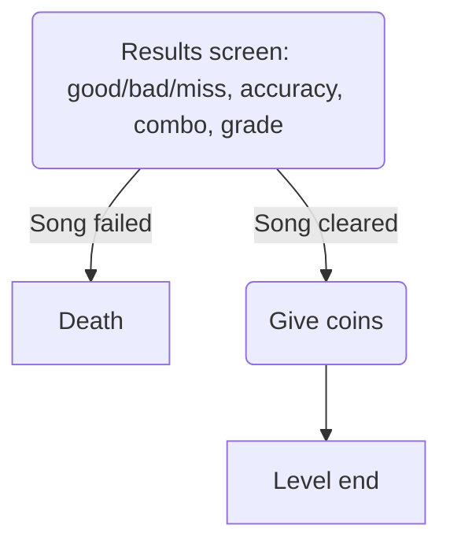

# Rsults screen

## Overall UI
A big rectangle in the center of the screen, with the following elements:
+ song title
+ judgement counters: good/bad/miss
+ combo and accuracy counters
+ big grade symbol
+ mini coins symbolizing actual rewarded coins
