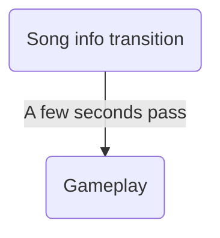

# Song info

## Main screen
A stripe slides onto the screen, showing the song title and author.
From now on, the controls are displayed on the bottom of the screen:
    `P1 = katsu // P2 = don`.
The player can change the controls by flipping P1 and P2.
A moment passes, the stripe slides off, and the gameplay begins.
