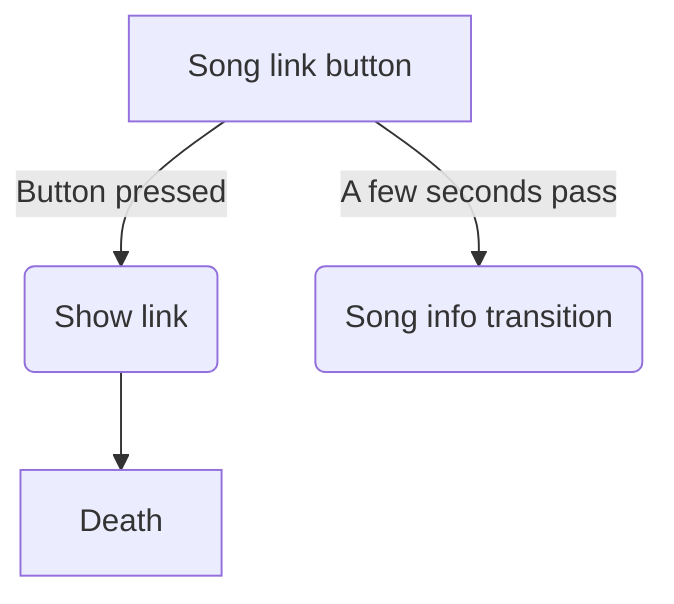

# Song link
_ONLY IF THE LEVEL ENDS UP NONG_

## Main screen
A button appears on the screen with the text `Song link`.
+ P1 click changes the screen to show the link to the song
+ Wait 3 seconds to skip

# Song link screen
The song link pops up on the screen, and after a few seconds
an invisible wall is hit, ending the level immediately.
